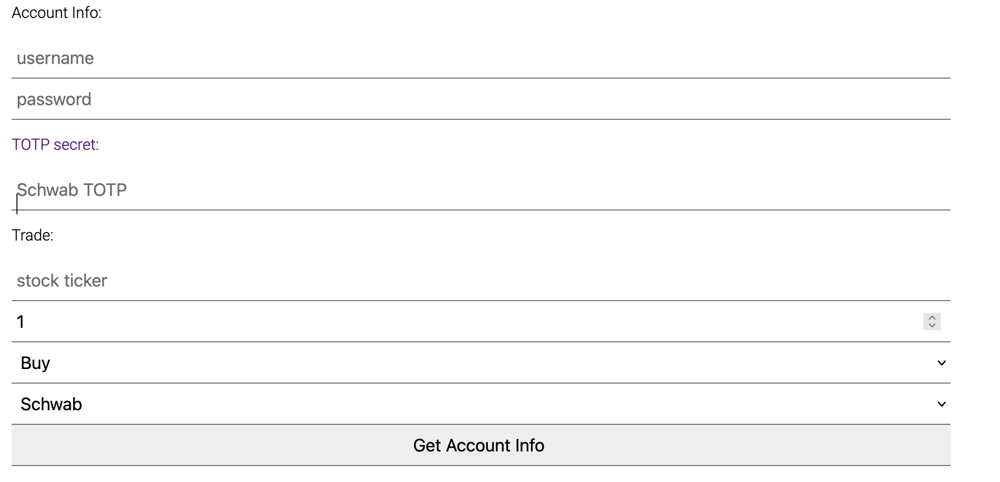

# Schwab API

**This is not an official API or even a stable recreation of a Charles Schwab API. Functionality may change with any updates made by Schwab.**

This package enables buying and selling securities programmatically on Charles Schwab. Currently, we use a headless browser to automate logging in in order to get authorization cookies. All other functionality is done through web requests made to Schwab's own API.


## Live Demo

I am currently using this package to place trades on Schwab using my website [here](https://itsjafer.com/#/reversesplit).



## Contribution

I would absolutely love contributions; as someone new to open source, I'd appreciate help in setting up a reliable system for PRs as well :)

## Getting Started

### Installing

Install using pypi and then download and install the playwright binaries:

```
pip install schwab-api
python -m playwright install
```

### Create a TOTP Authentication Token

In order to login to Schwab without having to go through SMS verification everytime, we can create an authentication token (TOTP) and attach that to our account.

If you'd like an easy way to do this, you can [go to my website and generate a TOTP there](https://itsjafer.com/#/schwab) by clicking 'Generate TOTP' and following the instructions.

Alternatively, you can do this programmatically:

```
from schwab_api import generate_totp

symantec_id, totp_secret = generate_totp()

print("Your symantec ID is: " + symantec_id)
print("Your TOTP secret is: " + totp_secret)
```

For the TOTP Secret:

1. Download Duo Mobile, Google Authenticator, or any other authenticator of your choice and create an entry using the TOTP secret. You will be prompted to generate a code everytime you log in to Schwab and will need an authenticator app to do so.
1. **Keep this TOTP secret handy** as you'll need to pass it to this API in order to login.

For the Symantec ID:

1. Log in to Schwab and go to your [security center](https://client.schwab.com/clientapps/access/securityCenter#/main/epass). 
1. Under two-step verification, select "Always at login", and then select "Security Token". 
1. **Enter the symantec ID here that you generated using the code above**.

### Quickstart

You can run this code in a [Colab Notebook here](https://github.com/itsjafer/schwab-api/blob/main/Schwab_API_Example.ipynb).

Here's some code that logs in, gets all account holdings, and makes a stock purchase:
```
from schwab_api import Schwab
import pprint

# Initialize our schwab instance
api = Schwab()

# Login using playwright
print("Logging into Schwab")
logged_in = api.login(
    username=username,
    password=password,
    totp_secret=totp_secret # Get this by generating TOTP at https://itsjafer.com/#/schwab
)

# Get information about all accounts holdings
print("Getting account holdings information")
account_info = api.get_account_info()
pprint.pprint(account_info)

print("The following account numbers were found: " + str(account_info.keys()))

print("Placing a dry run trade for AAPL stock")
# Place a dry run trade for each account
messages, success = api.trade(
    ticker="AAPL", 
    side="Buy", #or Sell
    qty=1, 
    account_id=99999999, # Replace with your account number
    dry_run=True # If dry_run=True, we won't place the order, we'll just verify it.
)

print("The order verification was " + "successful" if success else "unsuccessful")
print("The order verification produced the following messages: ")
pprint.pprint(messages)
```

## Features

* Buying and Selling tickers
* Multiple individual account support
* MFA and TOTP authentication
* Account and Position Information
* Headless playwright implementation

## TODO

* Currently, we use a headless browser to login to Schwab; in the future, we want to do this purely with requests.

